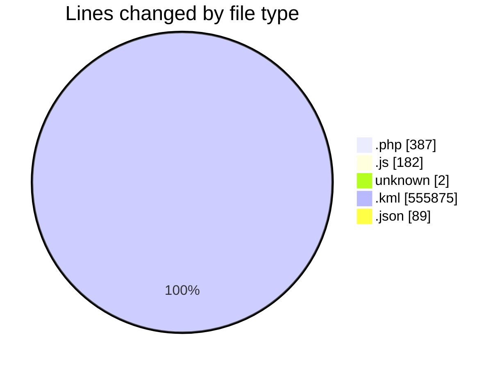
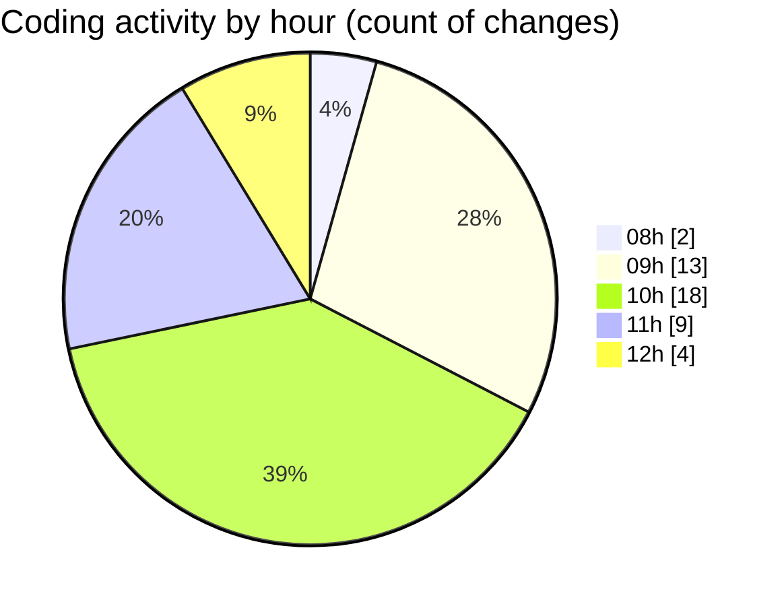

# KML - Activity Summary 

## Overall Statistics

| Stat                   | Value                                                             |
| ---------------------- | ----------------------------------------------------------------- |
| **Lines Added** (➕)   | 556417                                          |
| **Lines Removed** (➖) | 118                                        |
| **Net Change** (↕)    | 556299                |
| **Active Time** (⌚)   | 75 minutes |

## Modified Files
- **index.php** (+325, -62)
- **WebWorker.js** (+1, -0)
- **kmlWorker.js** (+100, -42)
- **webpack.config.js** (+25, -14)
- **.htaccess** (+2, -0)
- **EnerGis.kml** (+555875, -0)
- **settings.json** (+35, -0)
- **launch.json** (+54, -0)

## Visualizations

### By File Type (Lines Changed)

### By Hour (Estimated Activity Count)

> **Last Updated:** 3/26/2025, 12:15:58 PM