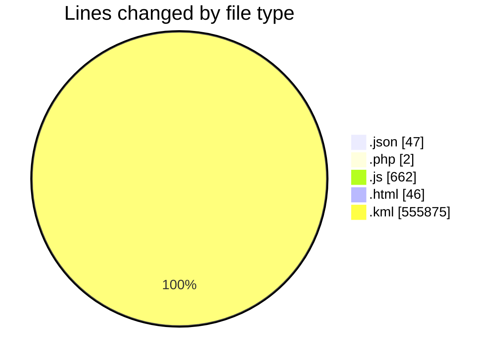
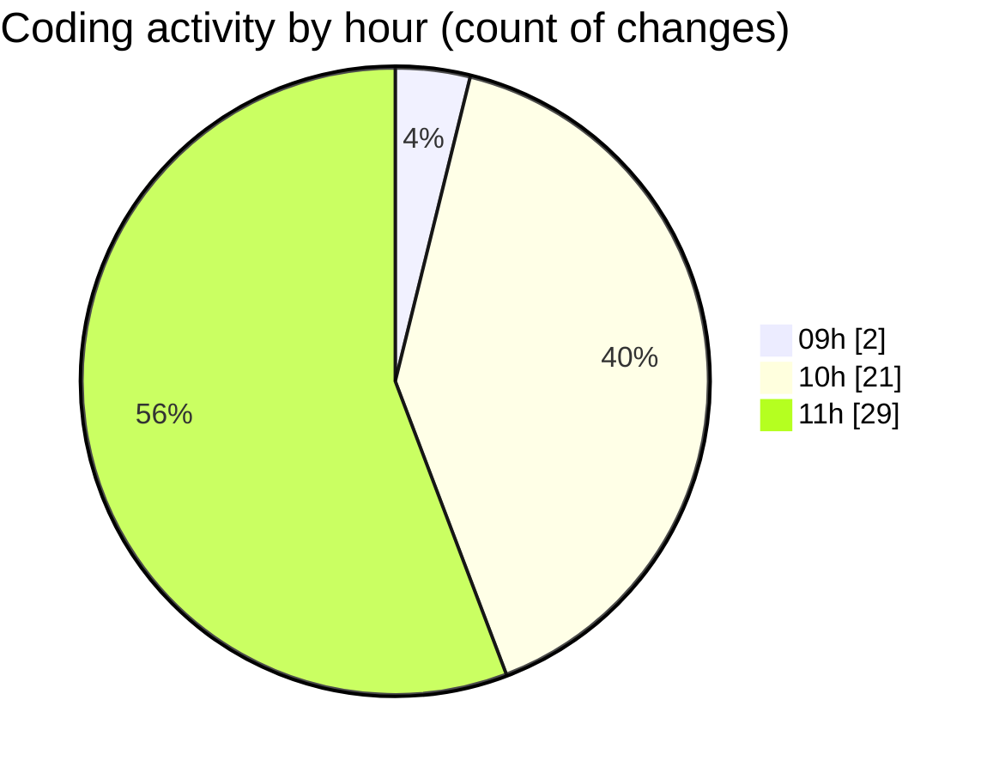

# KML - Activity Summary 

## Overall Statistics

| Stat                   | Value                                                             |
| ---------------------- | ----------------------------------------------------------------- |
| **Lines Added** (➕)   | 556390                                          |
| **Lines Removed** (➖) | 242                                        |
| **Net Change** (↕)    | 556148                |
| **Active Time** (⌚)   | 88 minutes |

## Modified Files
- **package.json** (+23, -10)
- **index.php** (+0, -2)
- **main.js** (+69, -0)
- **index.html** (+21, -0)
- **settings.json** (+1, -0)
- **main.js** (+365, -228)
- **EnerGis.kml** (+555875, -0)
- **index.html** (+23, -2)
- **package.json** (+13, -0)

## Visualizations

### By File Type (Lines Changed)

### By Hour (Estimated Activity Count)

> **Last Updated:** 3/27/2025, 11:48:09 AM