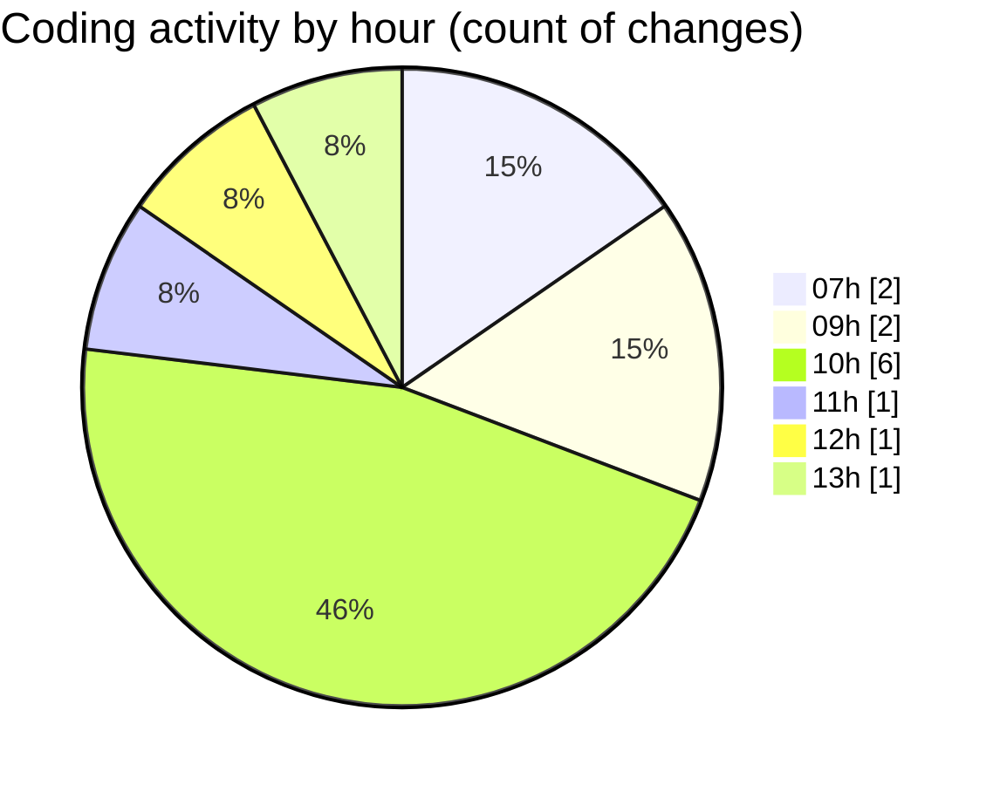

# enviarfacturas - Activity Summary 

## Overall Statistics

| Stat                   | Value                                                             |
| ---------------------- | ----------------------------------------------------------------- |
| **Lines Added** (➕)   | 94460                                          |
| **Lines Removed** (➖) | 1267                                        |
| **Net Change** (↕)    | 93193                |
| **Active Time** (⌚)   | 2 minutes |

## Modified Files
- **facturacion.php** (+413, -0)
- **log1.txt** (+91019, -0)
- **mail.php** (+205, -35)
- **NSLOOKUP.txt** (+33, -0)
- **INBOX_31252.txt** (+1395, -0)
- **FUENTE DE MAIL TEST.txt** (+1395, -1232)

## Visualizations

### By File Type (Lines Changed)

### By Hour (Estimated Activity Count)

> **Last Updated:** 2/9/2026, 1:23:00 PM