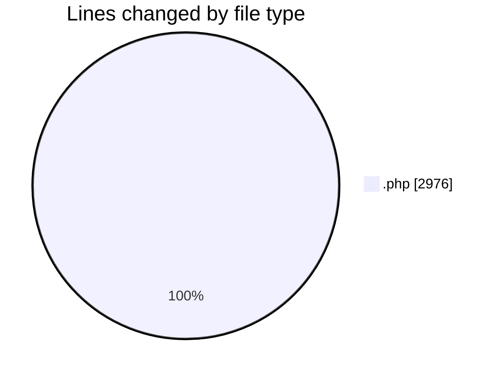
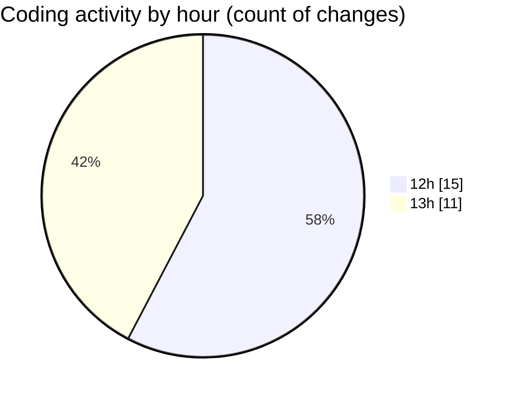

# fz3temp-2 - Activity Summary 

## Overall Statistics

| Stat                   | Value                                                             |
| ---------------------- | ----------------------------------------------------------------- |
| **Lines Added** (➕)   | 2937                                          |
| **Lines Removed** (➖) | 39                                        |
| **Net Change** (↕)    | 2898                |
| **Active Time** (⌚)   | 18 minutes |

## Modified Files
- **civilesyclubes.php** (+57, -0)
- **calc-consumo.php** (+1928, -0)
- **cambio-tit.php** (+39, -0)
- **bienpublico.php** (+55, -0)
- **suspsum.php** (+24, -0)
- **seguridad.php** (+245, -0)
- **prod-obraelec.php** (+92, -0)
- **obrs-elec.php** (+20, -0)
- **eng-contacto.php** (+89, -0)
- **elecdependientes.php** (+32, -0)
- **cuadro-tarf.php** (+31, -0)
- **energia-renv.php** (+108, -0)
- **uso-racional.php** (+101, -0)
- **violenciadegenero.php** (+43, -0)
- **sim-tarf.php** (+73, -39)

## Visualizations

### By File Type (Lines Changed)

### By Hour (Estimated Activity Count)

> **Last Updated:** 9/9/2026, 1:27:27 PM